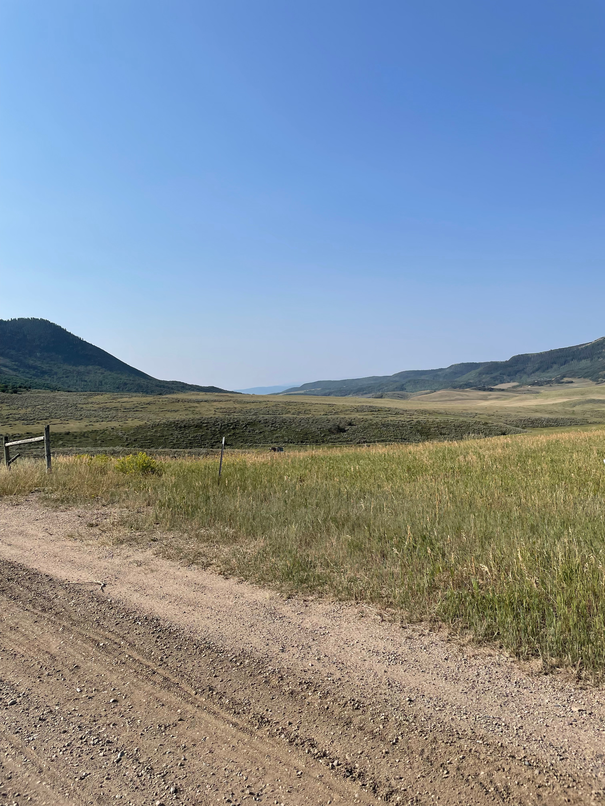

1. "That I know nothing of myself, that Siddhartha has remained so alien and unknown to me, this comes from a cause, from one single cause: I was afraid of myself, I was fleeing myself!"

-Siddhartha, Chapter: Awakening.

2. "Many people, Govinda, must go through a lot of changes, must wear all sorts of robes, I am one of them, dear friend."

-Siddhartha, Chapter: Govinda.

3. "He has robbed me, the Buddha."
-Siddhartha, Chapter: Gotama.

4. "But I, who wanted to read the book of the world and the book of my own being, I have, for the sake of a meaning I had anticipated before I read it, scorned the symbols and letters, I called the visible world a deception."

-Siddhartha, Chapter: Awakening.

5. "Wisdom cannot be imparted."

-Siddhartha, Chapter: Govinda.

6. "When someone seeks then it easily happens that his eyes see only the thing that he seeks, and he is able to find nothing, to take in nothing because he always thinks only about the thing he is seeking, because he has one goal, because he is obsessed with his goal."

-Siddhartha, Chapter: Govinda.

7. "Seeking means: having a goal. But finding means: being free, being open, having no goal."

-Siddhartha, Chapter: Govinda.

8. "I have no gift I could give you for your hospitality, my dear, and also no payment for your work. I am a man without a home, a son of a Brahman and a Samana."

-Siddhartha, Chapter: Kamala.

9. "And if time is not real, then the gap which seems to be between the world and the eternity, between suffering and blissfulness, between evil and good, is also a deception."

-Siddhartha, Chapter: Govinda.

10. "I had to experience despair, I had to sink to the greatest mental depths, to thoughts of suicide, in order to experience grace."

-Siddhartha, Chapter: By the River.